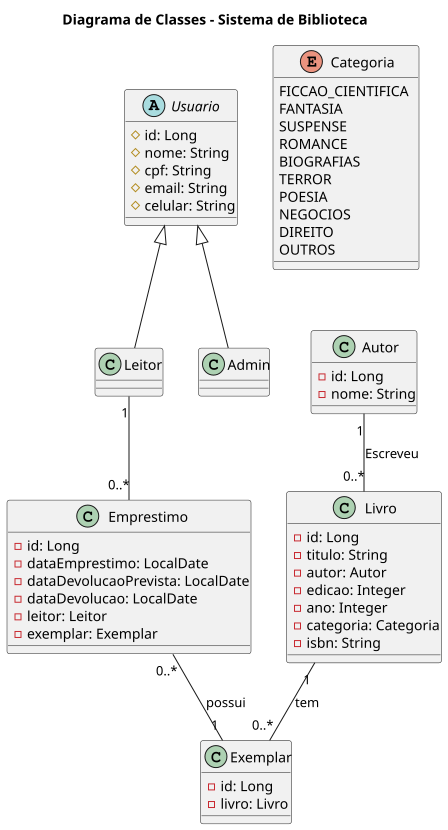
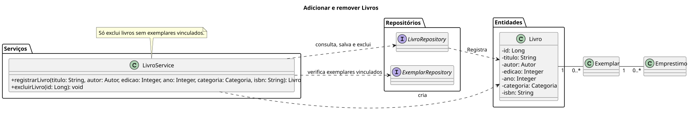
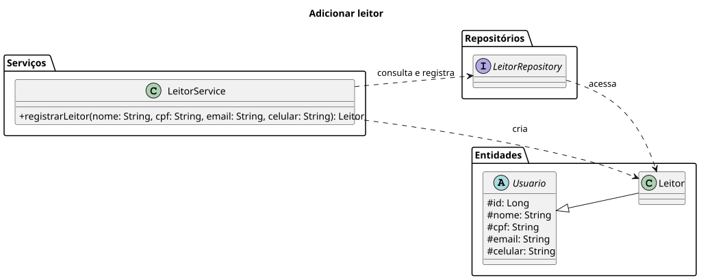
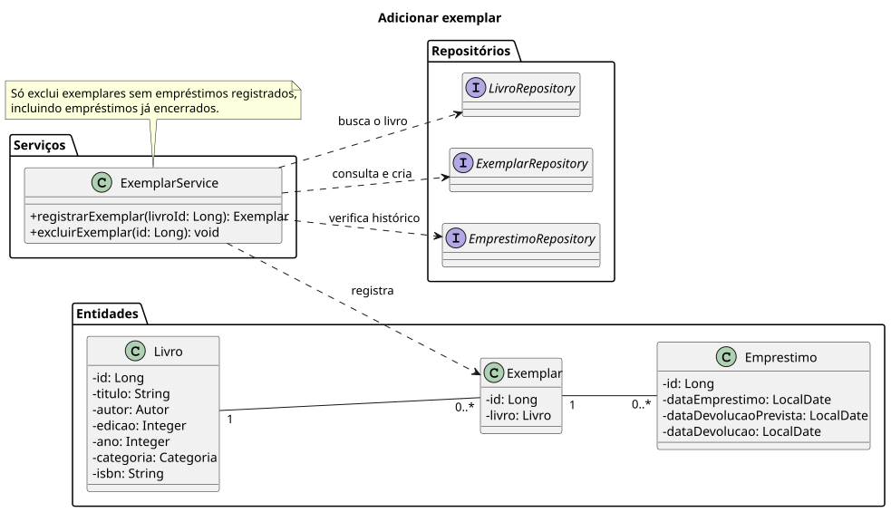
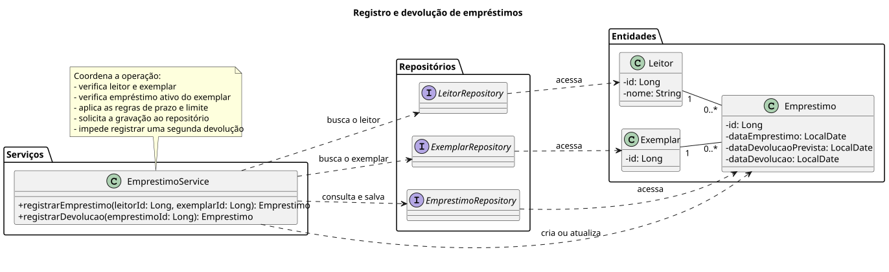

# Biblioteca API

API de gerenciamento de biblioteca criada para estudar Java, Spring Boot e PostgreSQL. O modelo inclui livros, autores, exemplares, leitores, administradores e empréstimos.

## Estado atual

A camada de serviços está em desenvolvimento. As entidades JPA e os repositories já estão definidos. Os services têm métodos de cadastro, listagem e busca por ID.

Ainda faltam os controllers, os DTOs e os endpoints HTTP dos cadastros, além das devoluções, exclusões e regras completas de disponibilidade e limite de empréstimos. A entidade `Admin` já existe; autenticação e autorização continuam pendentes.

As próximas etapas e as decisões em aberto estão no [roteiro de desenvolvimento](ROTEIRO.md).

## Tecnologias

| Tecnologia | Uso |
| --- | --- |
| Java 21 | Linguagem do projeto |
| Spring Boot 4.1.1 | Configuração e inicialização da aplicação |
| Spring Web MVC | Base para a futura camada HTTP |
| Spring Data JPA / Hibernate | Mapeamento das entidades e persistência |
| Jakarta Validation | Restrições nos campos das entidades |
| PostgreSQL | Banco de dados |
| Maven Wrapper | Build e execução |
| PlantUML | Diagramas de classes e serviços |

As versões de Java e Spring Boot estão definidas no [pom.xml](pom.xml).

## Modelo de domínio

- Autor: nome e identificação do autor de um livro.
- Livro: título, autor, categoria, edição, ano e ISBN.
- Exemplar: unidade de um livro que pode ser emprestada.
- Usuario: classe base de `Leitor` e `Admin`, com nome, CPF, e-mail e celular.
- Leitor: usuário que realiza os empréstimos.
- Admin: cadastro de administrador.
- Emprestimo: registro do empréstimo de um exemplar a um leitor, com datas de empréstimo, devolução prevista e devolução efetiva.

Um autor pode ter vários livros, e cada livro pode ter vários exemplares. Cada empréstimo pertence a um leitor e a um exemplar. Ambos podem ter vários registros de empréstimo ao longo do tempo.

## Serviços

Além do cadastro, todos os services têm os métodos `findAll` e `findById`.

| Serviço | O que faz hoje |
| --- | --- |
| `AutorService` | Cadastra autores. Rejeita ID preenchido, nome vazio e nome já existente. |
| `LivroService` | Cadastra livros com ISBN obrigatório e único. Busca o autor pelo ID ou pelo nome informado; na busca por nome, cria o autor se não o encontrar. |
| `LeitorService` | Cadastra leitores com nome, CPF, e-mail e celular obrigatórios. Verifica se o CPF ou o e-mail já estão cadastrados. |
| `AdminService` | Cadastra administradores com verificações semelhantes às do cadastro de leitores. |
| `ExemplarService` | Cadastra exemplares sem ID preenchido e com um livro informado. Ainda falta buscar o livro cadastrado. |
| `EmprestimoService` | Registra empréstimos com leitor e exemplar informados. Usa a data atual e prevê a devolução em 14 dias. A validação das associações e da disponibilidade ainda está pendente. |

O prazo de 14 dias já está no código. O limite de empréstimos e as demais regras do fluxo ainda precisam ser definidos e implementados, conforme o roteiro.

## Diagramas

As fontes estão em [docs/diagramas](docs/diagramas). Os diagramas de serviços mostram o fluxo planejado, incluindo operações e verificações que ainda faltam no código. Algumas assinaturas também são diferentes: os métodos atuais recebem objetos de entidade. A seção de serviços descreve o que já foi implementado.

### Classes do domínio



[Fonte PlantUML](docs/diagramas/classes.puml)

### LivroService



[Fonte PlantUML](docs/diagramas/livro-service.puml)

### LeitorService



[Fonte PlantUML](docs/diagramas/leitor-service.puml)

### ExemplarService



[Fonte PlantUML](docs/diagramas/exemplar-service.puml)

### EmprestimoService



[Fonte PlantUML](docs/diagramas/emprestimo-service.puml)

As imagens SVG são versionadas junto dos `.puml` e aparecem no README. Depois de editar um diagrama, gere as imagens novamente com o PlantUML instalado localmente:

```powershell
java -jar plantuml.jar -charset UTF-8 -tsvg docs/diagramas/*.puml
```

Para executar esse comando, `plantuml.jar` deve estar no diretório atual. Dependendo da instalação, você também pode precisar do Graphviz para renderizar os diagramas de classes.

## Estrutura

```text
.
├── docs/diagramas/                  # Fontes PlantUML e imagens SVG
├── src/main/java/com/lucas/biblioteca/
│   ├── entities/                    # Entidades JPA
│   │   └── enums/                   # Categorias dos livros
│   ├── repositories/               # Interfaces Spring Data JPA
│   ├── services/                   # Cadastros, consultas e regras de negócio
│   └── BibliotecaApplication.java   # Entrada da aplicação
├── src/main/resources/
│   └── application.properties      # Configuração da aplicação e do banco
├── src/test/java/                   # Teste de carregamento do contexto
├── pom.xml
└── ROTEIRO.md
```

## Executar localmente

Você precisa de um JDK compatível com Java 21 e de acesso ao PostgreSQL, com banco e usuário criados. O projeto inclui o Maven Wrapper, que baixa a distribuição do Maven no primeiro uso.

Na pasta que contém o `pom.xml`, configure as variáveis de ambiente no PowerShell:

```powershell
$env:DB_URL = "jdbc:postgresql://localhost:5432/biblioteca"
$env:DB_USERNAME = "seu_usuario"
$env:DB_PASSWORD = "sua_senha"
```

Use o endereço do seu banco e as suas credenciais. A aplicação lê essas três variáveis diretamente e não carrega um arquivo `.env` automaticamente.

Inicie a aplicação:

```powershell
.\mvnw.cmd spring-boot:run
```

No Linux ou macOS, exporte as mesmas variáveis no shell e execute `./mvnw spring-boot:run`.

Com `ddl-auto=update`, o Hibernate pode atualizar as tabelas ao iniciar. Use um banco de desenvolvimento. Os comandos seguem a configuração do projeto, mas a inicialização com o PostgreSQL configurado ainda precisa ser verificada.

## Testes

```powershell
.\mvnw.cmd test
```

O teste atual, `BibliotecaApplicationTests`, verifica se o contexto Spring carrega e depende da configuração do banco. Os testes das regras dos services e dos endpoints HTTP ainda precisam ser escritos.

## Próximas etapas

- Validar a persistência com PostgreSQL e revisar as regras dos cadastros.
- Criar DTOs, controller e tratamento de erros para o fluxo de autores.
- Expandir os endpoints para livros, leitores e exemplares.
- Implementar devoluções, exclusões e validações completas dos empréstimos.
- Adicionar testes de persistência e de regras de negócio.
